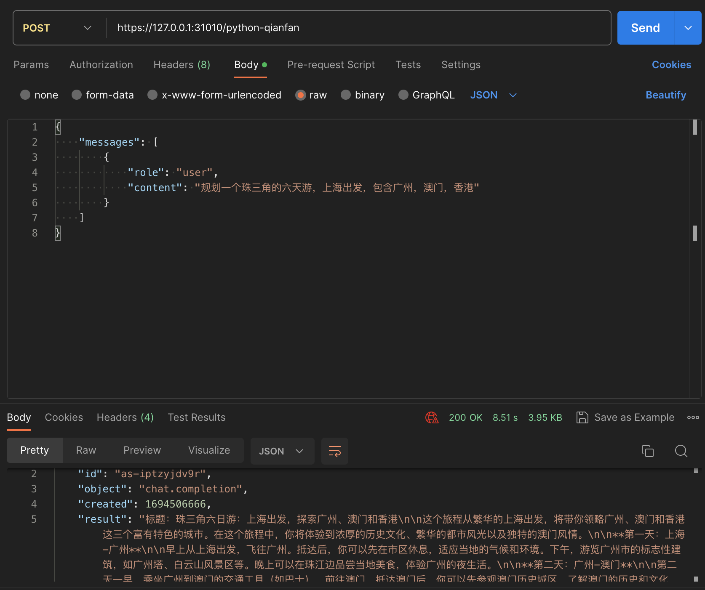

# 使用Baetyl函数计算调用文心一言

## 前言

当前文心一言未提供OpenAPI接入，需要使用百度智能云文心千帆的API接入，调用ERNIE-Bot或ERNIE-Bot-Turbo模型。

```json
{"name":"qianfan","description":"","cluster":false,"labels":{},"authType":"CERT","sysApps":["baetyl-function"]}
```

## 文心千帆平台操作

[文心千帆-API调用](https://cloud.baidu.com/doc/WENXINWORKSHOP/s/flfmc9do2)

在文心千帆平台创建完应用后，就可以拿到API访问的API Key以及Secret Key。

## Baetyl操作步骤

### 本地新建`index.py`文件，

copy下面的内容，并将其中的API_KEY和SECRET_KEY替换为千帆平台中应用的实际值。

```python
#!/usr/bin/env python3
# -*- coding: utf-8 -*-
import sys 
sys.path.append("/var/lib/baetyl/python3") 
import requests
import json

API_KEY = ""
SECRET_KEY = ""    

def get_access_token():
    """
    使用 AK，SK 生成鉴权签名（Access Token）
    :return: access_token，或是None(如果错误)
    """
    url = "https://aip.baidubce.com/oauth/2.0/token"
    params = {"grant_type": "client_credentials", "client_id": API_KEY, "client_secret": SECRET_KEY}
    return str(requests.post(url, params=params).json().get("access_token"))

def handler(event, context):
    url = "https://aip.baidubce.com/rpc/2.0/ai_custom/v1/wenxinworkshop/chat/eb-instant?access_token=" + get_access_token()
    
    payload = json.dumps(event)
    headers = {
        'Content-Type': 'application/json'
    }
    
    response = requests.request("POST", url, headers=headers, data=payload)

    return json.loads(response.text)

```

由于我们用到了 `requests` 库，因此需要在配置项中引入该依赖，依赖包的创建方法可以参考[自定义函数与依赖包解耦下发](https://cloud.baidu.com/doc/BIE/s/Xkzmt05tc)。上述代码中的如下两行代码，主要是用于引用依赖包函数。

```python
import sys 
sys.path.append("/var/lib/baetyl/python3") 
```

### 创建配置项`python3-request-package`

为了方便各位测试，我们已经在对象存储中上传了依赖包，使用POST调用`http://127.0.0.1:9004/v1/configs`, 创建依赖包的配置项。需要记录返回的配置项version，用于创建应用时填入。

```json
{
  "name": "python3-request-package",
  "data": [
    {
      "key": "python3-request.zip",
      "value": {
        "object": "python3-request.zip",
        "source": "http",
        "type": "object",
        "unpack": "zip",
        "url": "https://bie-document.gz.bcebos.com/baetyl-function/python3-request.zip"
      }
    }
  ],
  "description": ""
}
```

### 创建函数python-qianfan

使用POST调用`http://127.0.0.1:9004/v1/configs`, 创建函数配置项，其中key固定为index.py，在后续创建函数应用时需要填入该文件名。
value即为之前创建的index.py文件，用换行符隔开。需要记录返回的配置项version，用于创建应用时填入。

```json
{
  "name": "python-qianfan",
  "labels": {
    "baetyl-config-type": "baetyl-function",
    "baetyl-function": ""
  },
  "data": [
    {
      "key": "index.py",
      "value": {
        "type": "kv",
        "value": "#!/usr/bin/env python3\n# -*- coding: utf-8 -*-\nimport sys \nsys.path.append(\"/var/lib/baetyl/python3\") \nimport requests\nimport json\n\nAPI_KEY = \"\"\nSECRET_KEY = \"\"     \n\ndef get_access_token():\n    \"\"\"\n    使用 AK，SK 生成鉴权签名（Access Token）\n    :return: access_token，或是None(如果错误)\n    \"\"\"\n    url = \"https://aip.baidubce.com/oauth/2.0/token\"\n    params = {\"grant_type\": \"client_credentials\", \"client_id\": API_KEY, \"client_secret\": SECRET_KEY}\n    return str(requests.post(url, params=params).json().get(\"access_token\"))\n\ndef handler(event, context):\n    url = \"https://aip.baidubce.com/rpc/2.0/ai_custom/v1/wenxinworkshop/chat/eb-instant?access_token=\" + get_access_token()\n\n    payload = json.dumps(event)\n    headers = {\n        'Content-Type': 'application/json'\n    }\n\n    response = requests.request(\"POST\", url, headers=headers, data=payload)\n\n    return json.loads(response.text)"
      }
    }
  ]
}
```

### 创建节点

使用POST调用`http://127.0.0.1:9004/v1/nodes` 创建节点，系统应用选择baetyl-function。

```json
{"name":"qianfan","description":"","cluster":false,"labels":{},"authType":"CERT","sysApps":["baetyl-function"]}
```

### 创建函数应用

使用POST调用`http://127.0.0.1:9004/v1/apps` 创建函数应用，并将函数代码，依赖包挂载到容器中。

其中functions字段中的handler，因为python-qianfan函数的名称是index.py，函数当中定义了handler，所以此处为index.handler。

代码目录，使用点号`.`，表示当前目录。

```json
{
  "name": "python-qianfan",
  "mode": "kube",
  "type": "function",
  "selector": "baetyl-node-mode=kube,baetyl-node-name=qianfan",
  "services": [
    {
      "name": "python-qianfan",
      "image": "docker.io/baetyltechtest/python3:3.7-git-2e05ea4",
      "volumeMounts": [
        {
          "name": "baetyl-function-code-python-qianfan",
          "mountPath": "/var/lib/baetyl/code",
          "readOnly": true,
          "immutable": true
        },
        {
          "name": "python3-request",
          "mountPath": "/var/lib/baetyl/python3"
        }
      ],
      "ports": [],
      "resources": {},
      "functionConfig": {
        "name": "python-qianfan",
        "runtime": "python3"
      },
      "functions": [
        {
          "name": "qiangfan",
          "handler": "index.handler",
          "codedir": "."
        }
      ],
      "replica": 1,
      "jobConfig": {
        "restartPolicy": "Never"
      },
      "type": "deployment"
    }
  ],
  "volumes": [
    {
      "name": "baetyl-function-code-python-qianfan",
      "config": {
        "name": "python-qianfan",
        "version": "3287"
      }
    },
    {
      "name": "python3-request",
      "config": {
        "name": "python3-request-package",
        "version": "3249"
      }
    }
  ],
  "cronStatus": 0,
  "dnsPolicy": "ClusterFirst",
  "replica": 1,
  "workload": "deployment",
  "jobConfig": {},
  "ota": {},
  "autoScaleCfg": {}
}
```

## 测试运行

边缘节点安装，并等待所有Pod全部运行，然后可以使用postman进行调用测试。

使用k8s pod-forward将函数应用端口暴露出来，或者参考[Modbus实践](https://docs.baetyl.io/docs/cn/latest/practice/modbus.html)中
修改baetyl-broker端口映射的方式，修改baetyl-function的映射，来将函数计算服务进行暴露。

`kubectl port-forward -nbaetyl-edge-system baetyl-function-xxx 31010:50011`

在postman的General配置中，关闭SSL certificate verification，使用https，访问边缘节点的31010端口，加上函数应用名称为路径，就能成功调用到文心千帆提供的文心一言模型。其中Body内容，函数计算会进行透传，内容格式可参考[ERNIE-Bot-turbo API](https://cloud.baidu.com/doc/WENXINWORKSHOP/s/4lilb2lpf)


