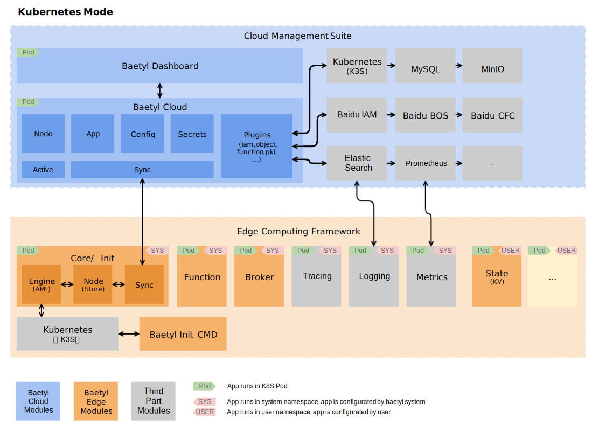

# Architecture

## Edge Computing Framework

The Edge Computing Framework runs on Kubernetes at the edge node,
manages and deploys all applications which provide various capabilities.
Applications include system applications and common applications.
All system applications are officially provided by Baetyl,
and you do not need to configure them.

There are currently several system applications:
* baetyl-init: responsible for activating the edge node to the cloud
and initializing baetyl-core, and will exit after all tasks are completed.
* baetyl-core: responsible for local node management (node),
data synchronization with cloud (sync) and application deployment (engine).
* baetyl-function: the proxy for all function runtime services,
function invocations are passed through this module.

Currently the framework supports Linux/amd64, Linux/arm64, Linux/armv7,
If the resources of the edge nodes are limited,
consider to use the lightweight kubernetes: [K3S](https://k3s.io/).

Hardware requirements scale based on the size of your applications at edge. Minimum recommendations are outlined here.
* RAM: 1GB Minimum
* CPU: 1 Minimum

## Cloud Management Suite

The Cloud Management Suite is responsible for managing all resources, including nodes, applications, configuration, and deployment. The realization of all functions is plug-in, which is convenient for function expansion and third-party service access, and provides rich applications. The deployment of the cloud management suite is very flexible. It can be deployed on public clouds, private cloud environments, and common devices. It supports K8S/K3S deployment, and supports single-tenancy and multi-tenancy.

The basic functions provided by the cloud management suite in this project are as follows:
* Edge node management
     * Online installation of edge computing framework
     * Synchronization (shadow) between edge and cloud
     * Node information collection
     * Node status collection
     * Application status collection
* Application deployment management
     * Container application
     * Function application
     * Node matching (automatic)
* Configuration management
     * Common configuration
     * Function configuration
     * Secrets
     * Certificates
     * Registry credentials

_The open source version contains the RESTful API of all the above functions, but does not include the front-end dashboard. _