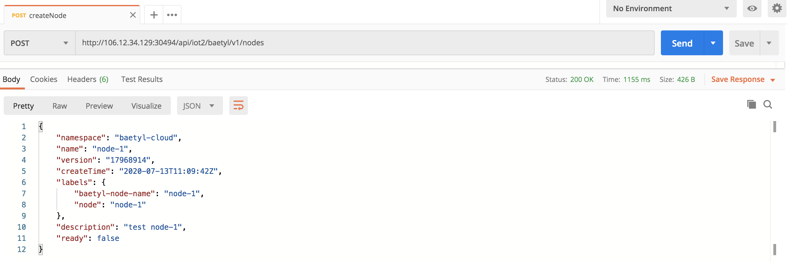

# Practice of Application Deployment

To create applications through the cloud and deploy them to edge devices, operations such as node creation, node installation, application creation and application node matching should be completed. Node installation can be completed before or after the application creation and node matching.
Application and node matching is achieved by configuring the application with the same "match label" specified by selector field as the node label (note that it is not the same as the application label). In this way, an application can be matched to more than one node, and a node can be associated with more than one application. 
The cloud monitors the target node based on the "match label" and performs application deployment for all nodes that meet the matching criteria. Multiple labels matching is also supported with "and" relationships between multiple labels. Applications are divided into container applications and function applications. 
Take container applications as an example, an application contains service configuration, data volume, mirror repository credentials, matching node labels, etc. An application may contain multiple services, but it is recommended that an application contain only one service. A service needs to configure the port, the number of copies, etc. In addition, it may also need to manage the configuration files and related data used by the service. We will deploy a Mosquitto Broker app at the edge device, which contains a Broker's service, configuration used by application, matches labels, and more.

## Create Node
Open Postman, then set Content-type to application/json in Headers. Add node name,description and labels to the body. Please note the labels **node=node-1** since it will be used later in application creation. Cloud service address is provided in [test environment](https://docs.baetyl.io/zh_CN/latest/quickstart/test-env.html). **api/iot2/baetyl** is used as the prefix. Refer to OpenAPI [Node Management/Create Node](https://docs.baetyl.io/en/latest/_static/api.html#u521bu5efau8282u70b90a3ca20id3d22u521bu5efau8282u70b9223e203ca3e) for detail usage information. In here，address is https://106.12.34.129:30494/api/iot2/baetyl/v1/nodes. Choose POST method and the body to send is shown as below
```
{
    "name":"node-1",
    "description": "test node-1",
    "labels":{
        "node":"node-1"
    }
}
```


Click Send to view the returned result and confirm that the node has been successfully created.



## Create Configuration

* broker configuration
  
Start by creating the configuration used by application. The configuration data contains multiple key-value pairs. The key is the file name and the value is the file content used when the service is loaded.
In here, data key is mosquitto.conf. data value (file content) is shown as below. Refer to [mosquitto config](https://mosquitto.org/man/mosquitto-conf-5.html) for more information. It mainly sets 1883 port to expose, data storage path and so on.
```
port 1883
autosave_interval 180
autosave_on_changes true
persistence true
persistence_file mosquitto.db
persistence_location /mosquitto/data/
log_type all
connection_messages true
log_dest file /mosquitto/log/mosquitto.log
allow_anonymous true
```

Set Content-type to application/json in Headers then choose POST method. Body to send is shown as below
```
{
    "name": "broker-conf-1",
    "description": "broker conf",
    "data": [
                {
                    "key": "mosquitto.conf",
                    "value": {
                        "type": "kv",
                        "value": "port 1883\nautosave_interval 180\nautosave_on_changes true\npersistence true\npersistence_file mosquitto.db\npersistence_location /mosquitto/data/\nlog_type all\nconnection_messages true\nlog_dest file /mosquitto/log/mosquitto.log\nallow_anonymous true"
                    }
                }
            ]
}
```
Address is http://106.12.34.129:30494/api/iot2/baetyl/v1/configs. Refer to OpenAPI [Configuration Management/Create Configuration](https://docs.baetyl.io/en/latest/_static/api.html#u521bu5efau914du7f6eu98790a3ca20id3d22u521bu5efau914du7f6eu9879223e203ca3e) for detail usage information.


Click Send to view the returned results and confirm that the configuration has been successfully created. Besides, please record the name of the configuration and the version information returned, which is needed to create the application.


## Create Application
There are several important parts to creating an application. The first is the information about the application itself, including the application name, the ports involved in the application, boot parameters and other informations. The second is the configuration used by the application, image repository credentials, and so on. The third matching labels. By configuring matching label that are the same as the expected deployment node, the application can be matched with the node, so as to achieve the goal of deploying the application to the expected edge device.

Set Content-type to application/json in Headers and choose POST method, body to send is shown as below. Please note the selector field which is same as the node labels previously.
```
{
  "name": "broker-1",
  "selector": "node=node-1",
  "description": "mosquitto broker",
  "services": [
    {
      "name":"broker",
      "image":"eclipse-mosquitto:1.6.9",
      "replica":1,
      "volumeMounts": [
        {
          "name": "conf",
          "mountPath": "/mosquitto/config",
          "readOnly": true
        }
      ],
      "ports": [
        {
          "hostPort": 1883,
          "containerPort": 1883,
          "protocol": "TCP"
        }
      ]
    }
  ],
  "volumes": [
    {
      "name": "conf",
      "config": {
        "name": "broker-conf-1",
        "version": "17966929"
      }
    }
  ]
}
```
The version of the configuration refered by **volumes[0].config.version** in the body needs to be modified based on the version returned in the previous step. Address is http://106.12.34.129:30494/api/iot2/baetyl/v1/apps. Refer to [Application Management/Create Application](https://docs.baetyl.io/en/latest/_static/api.html#u65b0u5efau5e94u75280a3ca20id3d22u65b0u5efau5e94u7528223e203ca3e) for details.


Click Send to view the returned result to verify that application has been successfully created.


## Node Installation
Acquiring installation command is prerequisite for node installation. Set Content-type to applicaiton/json in Headers and choose GET method. The Address is http://106.12.34.129:30494/api/iot2/baetyl/v1/nodes/node-1/init, Refer to [Node Management/Node Installation](https://docs.baetyl.io/en/latest/_static/api.html#u83b7u53d6u5b89u88c5u547du4ee40a3ca20id3d22u83b7u53d6u5b89u88c5u547du4ee4223e203ca3e) for details.

Click Send to get the result and copy it to your device and execute then.


Since baetyl is based on k3s/k8s, when initialized, if k3s/k8s not installed on the device, you need to select the relevant components to install. There are **k3s+containerd** and **k3s+docker** two modes. After executing the command, you will be prompted to install k3s. You need to enter y to confirm the installation of k3s. Then you need to choose whether to install Containerd or Docker. Containerd will be installed if you type y and the mode of baetyl will be **k3s+containerd**, if you type n, then docker will be installed thus mode of baetyl is **k3s+docker**.


Check that the system application service is up and running. System application are in **baetyl-edge-system** namespace，including **baetyl-core** and **baetyl-function** two deployments，user applications are in **baetyl-edge** namespace. Confirming that the broker application in baetyl-edge namespace created previously is in Running status, indicating that the application has started normally.


To get the device stats, query device stats interface **/v1/nodes/:name/stats**. Set request address to http://106.12.34.129:30494/api/iot2/baetyl/v1/nodes/node-1/stats and choose GET method. Click Send to get the device stats. Device hardware and resource status are included in returned response. "ready" field means that the edge device is connected to the cloud.


In addition, the return result contains the stats of all applications, and you can see that the status of user application **Broker** previously deployed is Running.


Connect to edge devices using [MQTTBox](http://workswithweb.com/html/mqttbox/downloads.html) clients. The exposed port of the deployed MQTT Broker is 1883 and the subscribed topics are not restricted. Subscribe to the **test** topic and send a message to verify that the message is received, indicating that the MQTT Broker is up and running.


